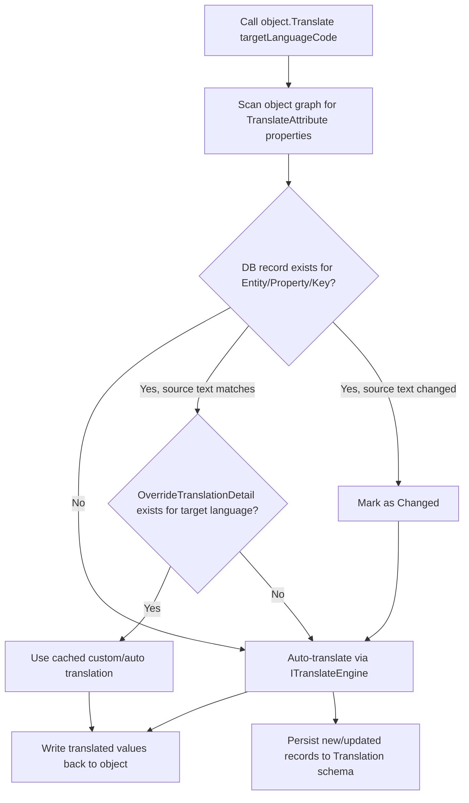

# DynamicTranslate

Runtime translation for nested .NET POCO objects. Mark properties with `[Translate]`, call `.Translate("ar")` with a single target language code, and the library automatically translates strings, caches results in the database, detects when source text changes, and supports custom per-language overrides.

Works with **any .NET version** that supports .NET Standard 2.0 (including .NET Framework, .NET Core, and modern .NET), and **any EF Core relational database provider** (SQL Server, PostgreSQL, MySQL, SQLite, Oracle, and others).

**Demo video:** [https://youtu.be/-iOLKU_5aOw](https://youtu.be/-iOLKU_5aOw)

---

## Features

| Feature | Description |
|--------|-------------|
| **Automatic dynamic translation** | Translates marked string properties on any object graph (nested objects and collections). |
| **Change detection** | Compares current source text with the cached value in the database. If the text changed, it re-translates and refreshes the cache. |
| **Translation caching** | Stores auto-translated results in your EF Core database so repeat requests skip the translation engine. |
| **Any .NET + any EF provider** | Library targets .NET Standard 2.0; translation tables work with any relational EF Core provider you already use. |
| **Custom overrides per language** | After auto-translation is registered in DB, `UPDATE OverrideTranslationDetails` with hand-crafted text per language code. |
| **Entity-keyed translations** | Tie translations to a specific entity instance using `Entity + Property + Key` (e.g. lookup name by Id). |
| **Key-based translations** | Tie translations to a stable code/key property (e.g. error messages keyed by error code). |
| **Pluggable translation engine** | Replace the default [GTranslate](https://www.nuget.org/packages/GTranslate) engine with your own `ITranslateEngine` implementation. |
| **ASP.NET Core integration** | Register `TranslationResultFilter` globally; frontend sends target language via `Accept-Language` header. |
| **Nested DTO graphs** | Mark properties at each level; collections and nested objects are walked automatically. |

---

## How it works



1. Properties decorated with `[Translate]` are collected recursively (including nested objects and `IEnumerable` collections).
2. For entity- or key-based properties, the library looks up `Translation.OverrideTranslations` by `Entity`, `Property`, `Key`, and source language.
3. If a record exists and **source text matches**, the matching `OverrideTranslationDetail` for the target language is used (custom or previously auto-translated).
4. If source text **changed**, the old record is replaced and a fresh translation is generated.
5. If no target-language detail exists, the engine translates and a new detail row is added.
6. Translated strings are written back onto the original object in place.

---

## Platform compatibility

| | Supported |
|---|-----------|
| **.NET versions** | Any project that targets **.NET Standard 2.0** or higher — e.g. .NET Framework 4.6.1+, .NET Core 2.0+, .NET 5/6/7/8/9+ |
| **Database providers** | Any **EF Core relational provider** — SQL Server, PostgreSQL, MySQL/MariaDB, SQLite, Oracle, Firebird, etc. |
| **Hosting** | ASP.NET Core Web API, minimal APIs, console apps, worker services, or any app where you can call `.Translate()` on a POCO |
| **Demo project** | .NET 8 + SQL Server (reference only; not a requirement for the library) |

The library does not depend on a specific database engine. Point your existing `DbContext` at whichever EF Core provider you already use, call `AddTranslationConfiguration()`, and run migrations against that database.

**Example — register with different providers:**

```csharp
// SQL Server
builder.Services.AddDbContext<AppDbContext>(o => o.UseSqlServer(connectionString));

// PostgreSQL
builder.Services.AddDbContext<AppDbContext>(o => o.UseNpgsql(connectionString));

// MySQL
builder.Services.AddDbContext<AppDbContext>(o => o.UseMySql(connectionString, ServerVersion.AutoDetect(connectionString)));

// SQLite
builder.Services.AddDbContext<AppDbContext>(o => o.UseSqlite(connectionString));

// Then register DynamicTranslate with the same DbContext type
builder.Services.AddDynamicTranslate(typeof(AppDbContext));
```

> **Schema note:** Translation tables are created under the `Translation` schema. Most providers support this natively; for providers with limited schema support (e.g. SQLite), EF Core maps the schema accordingly during migration.

---

## Installation

### NuGet (library only)

```bash
dotnet add package DynamicTranslate
```

### From source

```bash
git clone https://github.com/engmustafak26/DynamicTranslate.git
cd DynamicTranslate
dotnet restore
```

---

## Quick start

### 1. Register services

Pass your EF Core `DbContext` type so translation records can be persisted. Use whichever EF Core provider your application already uses:

```csharp
using DynamicTranslate;
using Microsoft.EntityFrameworkCore;

builder.Services.AddDbContext<ApplicationDbContext>(options =>
    options.UseSqlServer(connectionString));   // or UseNpgsql, UseMySql, UseSqlite, etc.

builder.Services.AddDynamicTranslate(typeof(ApplicationDbContext));
```

Optional: supply a custom translation engine:

```csharp
builder.Services.AddDynamicTranslate(typeof(ApplicationDbContext), myCustomEngine);
```

### 2. Configure EF Core model

In your `DbContext.OnModelCreating`:

```csharp
using DynamicTranslate.DB;

protected override void OnModelCreating(ModelBuilder modelBuilder)
{
    modelBuilder.AddTranslationConfiguration();
    base.OnModelCreating(modelBuilder);
}
```

This creates two tables under the **`Translation`** schema:

- `OverrideTranslations` — source text + entity/key metadata
- `OverrideTranslationDetails` — one row per target language translation

Run migrations after adding the configuration:

```bash
dotnet ef migrations add AddTranslationTables
dotnet ef database update
```

### 3. Mark a nested DTO graph

The library walks the full object graph — nested objects and collections are translated automatically. Mark each translatable `string` property with `[Translate]`, using the record `Id` as the cache key so each seeded row gets its own translation entry.

**Object graph (demo):**

```
LookupCategoryDTO
├── Id
├── Name          ← [Translate(..., Name, Id)]
└── Lookups[]     ← LookupMasterDTO
    ├── Id
    ├── Name      ← [Translate(..., Name, Id)]
    └── Details[] ← LookupDetailDTO
        ├── Id
        └── Name  ← [Translate(..., Name, Id)]
```

**DTOs** (`DynamicTranslate.Demo/DTO/`):

```csharp
public class LookupCategoryDTO
{
    public long Id { get; set; }

    [Translate(nameof(LookupCategoryDTO), nameof(Name), nameof(Id))]
    public string Name { get; set; }

    public LookupMasterDTO[] Lookups { get; set; }
}

public class LookupMasterDTO
{
    public long Id { get; set; }

    [Translate(nameof(LookupMasterDTO), nameof(Name), nameof(Id))]
    public string Name { get; set; }

    public LookupDetailDTO[] Details { get; set; }
}

public class LookupDetailDTO
{
    public long Id { get; set; }

    [Translate(nameof(LookupDetailDTO), nameof(Name), nameof(Id))]
    public string Name { get; set; }
}
```

**Seed data** (English source text in your app database — `ApplicationDbContext`):

```csharp
modelBuilder.Entity<LookupCategory>().HasData(
    new LookupCategory { Id = 1, Name = "books" }
);

modelBuilder.Entity<LookupMaster>().HasData(
    new LookupMaster { Id = 1, Name = "Computer Science", CategoryId = 1 },
    new LookupMaster { Id = 2, Name = "Physics", CategoryId = 1 }
    // ...
);

modelBuilder.Entity<LookupDetail>().HasData(
    new LookupDetail { Id = 1, Name = "Clean Code: A Handbook of Agile Software Craftsmanship", MasterId = 1 },
    new LookupDetail { Id = 2, Name = "Design Patterns: Elements of Reusable Object-Oriented Software", MasterId = 1 }
    // ...
);
```

**Controller** — map domain entities to the marked DTO graph and return; no manual `Translate()` call needed when using the global filter (see step 5):

```csharp
var categories = await _context.LookupCategories
    .Include(m => m.LookupMasters)
    .ThenInclude(d => d.LookupDetails)
    .Select(m => new LookupCategoryDTO
    {
        Id = m.Id,
        Name = m.Name,
        Lookups = m.LookupMasters.Select(d => new LookupMasterDTO
        {
            Id = d.Id,
            Name = d.Name,
            Details = d.LookupDetails.Select(d => new LookupDetailDTO
            {
                Id = d.Id,
                Name = d.Name
            }).ToArray(),
        }).ToArray()
    })
    .ToListAsync();

return Ok(categories);
```

On the first request with a target language, every marked `Name` in the graph is auto-translated and registered in `Translation.OverrideTranslations` / `OverrideTranslationDetails`, keyed by `Entity + Property + Id`.

**Key-based** (translate `Error` text keyed by stable `Code` — ideal for API/business messages):

```csharp
public class ApiResponse
{
    public string Code { get; set; }

    [Translate(nameof(Code))]
    public string Error { get; set; }
}
```

**Simple** (translate every occurrence of the property value; no DB keying):

```csharp
[Translate]
public string Description { get; set; }
```

### 4. Translate at runtime (manual)

Pass **one target language code** only. Source text is assumed to be English (`en`) by default.

```csharp
var categories = await GetCategoriesFromDatabase();
await categories.Translate("ar");
return categories;
```

Signature:

```csharp
Task<T> Translate<T>(
    this T obj,
    string targetLanguageCode,
    string sourceLanguageCode = "en",  // optional; defaults to English
    CancellationToken cancellationToken = default)
```

| Parameter | Required | Description |
|-----------|----------|-------------|
| `targetLanguageCode` | **Yes** | Language to translate into (e.g. `"ar"`, `"fr"`, `"de"`) |
| `sourceLanguageCode` | No | Source language of the text; defaults to `"en"` |

### 5. Global translation via ResultFilter + `Accept-Language`

Register a result filter once and every API response is translated automatically. The frontend (or any HTTP client) sends the target language in the **`Accept-Language`** header — no per-controller code required.

**Register globally** in `Program.cs`:

```csharp
using DynamicTranslate.Demo.Filters;

builder.Services.AddDynamicTranslate(typeof(ApplicationDbContext));

builder.Services.AddControllers(opt => opt.Filters.Add<TranslationResultFilter>());
```

**Result filter** — reads `Accept-Language`, passes the single target language to `.Translate()`:

```csharp
public class TranslationResultFilter : ResultFilterAttribute
{
    public override async Task OnResultExecutionAsync(ResultExecutingContext context, ResultExecutionDelegate next)
    {
        var language = GetLanguageFromHeader(context.HttpContext.Request);

        if (context.Result is ObjectResult objectResult && objectResult.Value != null)
        {
            await objectResult.Value.Translate(language);
        }

        await base.OnResultExecutionAsync(context, next);
    }

    private static string GetLanguageFromHeader(HttpRequest request)
    {
        var acceptLanguage = request.Headers["Accept-Language"].FirstOrDefault();
        if (string.IsNullOrEmpty(acceptLanguage))
            return "en";

        // "ar-SA, en;q=0.9" → "ar"
        var preferred = acceptLanguage.Split(',')
            .Select(l => l.Split(';')[0].Trim())
            .FirstOrDefault(l => !string.IsNullOrEmpty(l));

        return preferred?.Length >= 2
            ? preferred[..2].ToLowerInvariant()
            : preferred?.ToLowerInvariant() ?? "en";
    }
}
```

**Frontend / client** — set the header; the filter handles the rest:

```javascript
// Browser fetch
fetch('/Demo/categories-with-details-with-auto-translation', {
  headers: { 'Accept-Language': 'ar' }
});
```

```csharp
// C# HttpClient
client.DefaultRequestHeaders.Add("Accept-Language", "ar");
```

```bash
# cURL
curl -H "Accept-Language: ar" \
  "https://localhost:7210/Demo/categories-with-details-with-auto-translation"
```

Controllers stay clean — they only return DTOs. The filter runs after the action and before the response is serialized.

> **Swagger note:** The demo endpoints accept a `?lang=ar` query parameter that sets `Accept-Language` for testing in Swagger. Real frontends should send the header directly.

---

## Custom translation overrides (per language)

After the first auto-translation, rows are stored in the **`Translation`** schema. You can **UPDATE** those rows to replace machine translation with human-reviewed text. No manual INSERT is needed — let the library register translations first, then override them.

### Workflow

1. Call the API once with the target language (e.g. `Accept-Language: ar`).
2. The library auto-translates and **INSERT**s master + detail rows into the database.
3. **UPDATE** the detail row with your custom translation.
4. Subsequent requests return the custom text from the cache (no translation engine call).

### Database structure

**`Translation.OverrideTranslations`** (master — one row per translatable item)

| Column | Description |
|--------|-------------|
| `LanguageCode` | Source language of `Text` (e.g. `en`) |
| `Entity` | DTO/entity name from `[Translate]` |
| `Property` | Property name from `[Translate]` |
| `Key` | Key value (e.g. record Id or error code) |
| `Text` | Original source text |

**`Translation.OverrideTranslationDetails`** (detail — one row per target language)

| Column | Description |
|--------|-------------|
| `OverrideTranslationId` | FK to master row |
| `LanguageCode` | Target language (e.g. `ar`, `fr`) |
| `Translation` | Auto or custom translated text |

### Example: override a lookup category name (after first `lang=ar` call)

Step 1 — trigger auto-registration:

```bash
curl -H "Accept-Language: ar" \
  "https://localhost:7210/Demo/categories-with-details-with-auto-translation"
```

Step 2 — replace the auto-translated Arabic for category `Id = 1` (`Entity = LookupCategoryDTO`, `Key = 1`):

```sql
UPDATE d
SET d.Translation = N'كتب'
FROM Translation.OverrideTranslationDetails d
INNER JOIN Translation.OverrideTranslations m ON d.OverrideTranslationId = m.Id
WHERE m.Entity = 'LookupCategoryDTO'
  AND m.Property = 'Name'
  AND m.[Key] = '1'
  AND d.LanguageCode = 'ar';
```

Step 3 — next request returns **`كتب`** from the database instead of the previous auto-translation.

### Example: override a book title (nested detail, `Key = 1`)

```sql
UPDATE d
SET d.Translation = N'الكود النظيف: دليل برمجة احترافية'
FROM Translation.OverrideTranslationDetails d
INNER JOIN Translation.OverrideTranslations m ON d.OverrideTranslationId = m.Id
WHERE m.Entity = 'LookupDetailDTO'
  AND m.Property = 'Name'
  AND m.[Key] = '1'
  AND d.LanguageCode = 'ar';
```

### Example: override a business error message (after first translated error)

Call the order endpoint once with `Accept-Language: ar` so the error code is registered. Then update by `Key` (the error code):

```sql
UPDATE d
SET d.Translation = N'الطلب المطلوب غير موجود'
FROM Translation.OverrideTranslationDetails d
INNER JOIN Translation.OverrideTranslations m ON d.OverrideTranslationId = m.Id
WHERE m.[Key] = 'order_not_found'
  AND d.LanguageCode = 'ar';
```

> **Note:** For key-based `[Translate(nameof(Code))]` attributes, `Entity` and `Property` are null; only `Key` (the code value) and `Text` are used for lookup.

### Change detection behavior

| Status | Meaning | Action |
|--------|---------|--------|
| **Found** | Source text matches DB; target language detail exists | Use cached translation (custom or auto) |
| **Changed** | Source text differs from stored `Text` | Re-translate, replace master row, update details |
| **TargetLanguageNotFound** | Master exists, no detail for target language | Auto-translate and insert new detail |
| **NotFound** | No master row | Auto-translate and insert master + detail |

---

## Custom translation engine

Implement `ITranslateEngine`:

```csharp
using DynamicTranslate.Translation;

public class MyTranslateEngine : ITranslateEngine
{
    public Task<string[]> TranslateAsync(
        string[] input,
        string targetLanguageCode,
        string sourceLanguageCode = "en")
    {
        // Translate input array and return same-length array
        return Task.FromResult(input.Select(t => /* your logic */ t).ToArray());
    }
}
```

Register when calling `AddDynamicTranslate`:

```csharp
builder.Services.AddDynamicTranslate(typeof(ApplicationDbContext), new MyTranslateEngine());
```

The default engine uses [GTranslate](https://www.nuget.org/packages/GTranslate) `AggregateTranslator`.

---

## Demo project (`DynamicTranslate.Demo`)

The demo is an ASP.NET Core 8 Web API that shows end-to-end integration with SQL Server, Swagger, and a global result filter.

### Run the demo

1. Update the connection string in `DynamicTranslate.Demo/appsettings.json`.
2. Apply migrations:

   ```bash
   cd DynamicTranslate.Demo
   dotnet ef database update
   ```

3. Run the API:

   ```bash
   dotnet run
   ```

4. Open Swagger: [https://localhost:7210/swagger](https://localhost:7210/swagger) (or [http://localhost:5162/swagger](http://localhost:5162/swagger))

### Demo architecture

```
Frontend  Accept-Language: ar
    ↓
Controller  returns nested DTO graph (English from seed data)
    ↓
TranslationResultFilter  object.Translate("ar")
    ↓
Response  JSON with translated nested Names
```

**`Program.cs`** — service + global filter registration:

```csharp
builder.Services.AddDbContext<ApplicationDbContext>(options =>
    options.UseSqlServer(builder.Configuration.GetConnectionString("DefaultConnection")));

builder.Services.AddDynamicTranslate(typeof(ApplicationDbContext));

builder.Services.AddControllers(opt => opt.Filters.Add<TranslationResultFilter>());
```

See [step 5 in Quick start](#5-global-translation-via-resultfilter--accept-language) for the full filter implementation and frontend header examples.

Language is taken from the `Accept-Language` header (first two-letter code, e.g. `en-US` → `en`). Default is `en`.

---

## Demo API endpoints

Base URL: `https://localhost:7210` (HTTPS profile) or `http://localhost:5162` (HTTP profile).

The `lang` query parameter in the demo sets `Accept-Language` for Swagger only. Production frontends should send the header directly (see [Global translation via ResultFilter](#5-global-translation-via-resultfilter--accept-language)).

---

### GET `/Demo/categories-with-details-with-auto-translation`

Returns nested lookup categories, masters, and book details. All `Name` fields are translated to the target language.

**Request:**

```bash
curl -X 'GET' \
  'https://localhost:7210/Demo/categories-with-details-with-auto-translation?lang=ar' \
  -H 'accept: */*'
```

**Response** (`lang=ar` — Arabic):

```json
[
  {
    "id": 1,
    "name": "كتب",
    "lookups": [
      {
        "id": 1,
        "name": "علوم الكمبيوتر",
        "details": [
          {
            "id": 1,
            "name": "الكود النظيف: كتيب عن براعة البرمجيات الرشيقة"
          },
          {
            "id": 2,
            "name": "أنماط التصميم: عناصر البرامج الموجهة للكائنات القابلة لإعادة الاستخدام"
          },
          {
            "id": 5,
            "name": "مقدمة في الخوارزميات"
          },
          {
            "id": 6,
            "name": "المبرمج العملي"
          },
          {
            "id": 7,
            "name": "شبكات الكمبيوتر: نهج من أعلى إلى أسفل"
          }
        ]
      },
      {
        "id": 2,
        "name": "الفيزياء",
        "details": [
          {
            "id": 3,
            "name": "فيزياء الكم"
          },
          {
            "id": 4,
            "name": "الأجهزة"
          },
          {
            "id": 8,
            "name": "محاضرات فاينمان في الفيزياء"
          },
          {
            "id": 9,
            "name": "مقدمة في ميكانيكا الكم"
          },
          {
            "id": 10,
            "name": "الميكانيكا الكلاسيكية"
          },
          {
            "id": 11,
            "name": "الديناميكا الحرارية والميكانيكا الإحصائية"
          }
        ]
      },
      {
        "id": 3,
        "name": "الرياضيات",
        "details": [
          {
            "id": 12,
            "name": "حساب التفاضل والتكامل: المتعالي المبكر"
          },
          {
            "id": 13,
            "name": "الجبر الخطي وتطبيقاته"
          },
          {
            "id": 14,
            "name": "الاحتمالات والإحصاء"
          },
          {
            "id": 15,
            "name": "الرياضيات المنفصلة وتطبيقاتها"
          }
        ]
      },
      {
        "id": 4,
        "name": "علم الأحياء",
        "details": [
          {
            "id": 16,
            "name": "البيولوجيا الجزيئية للخلية"
          },
          {
            "id": 17,
            "name": "علم الوراثة: تحليل الجينات والجينوم"
          },
          {
            "id": 18,
            "name": "علم البيئة: المفاهيم والتطبيقات"
          }
        ]
      },
      {
        "id": 5,
        "name": "التاريخ",
        "details": [
          {
            "id": 19,
            "name": "العاقل: تاريخ موجز للبشرية"
          },
          {
            "id": 20,
            "name": "تاريخ العالم القديم"
          },
          {
            "id": 21,
            "name": "تاريخ الشعب في الولايات المتحدة"
          }
        ]
      },
      {
        "id": 6,
        "name": "الدين",
        "details": []
      }
    ]
  }
]
```

First call auto-translates and caches to `Translation.OverrideTranslations` / `OverrideTranslationDetails`. Later calls reuse the cache. Change a seed name in the database and call again to see change detection re-translate.

---

### POST `/Demo/create-order-with-dynamic-business-error-translation`

Returns a random business validation error. The `Error` message is translated using the stable `Code` as the translation key.

**Request:**

```bash
curl -X 'POST' \
  'https://localhost:7210/Demo/create-order-with-dynamic-business-error-translation?lang=ar' \
  -H 'accept: */*' \
  -H 'Content-Type: application/json' \
  -d '{
  "customer": "string",
  "item": "string",
  "qty": 0
}'
```

**Response** (`lang=ar` — Arabic):

```json
{
  "isSuccess": false,
  "error": "تم اكتشاف طلب مكرر، وهو موجود بالفعل خلال الـ 24 ساعة الماضية"
}
```

(`Code` is `[JsonIgnore]` and not serialized. Each request may return a different random error message, all translated to the target language.)

---

## Client examples

### C# (`HttpClient`)

```csharp
using System.Net.Http.Json;

var client = new HttpClient { BaseAddress = new Uri("https://localhost:7210") };
client.DefaultRequestHeaders.Add("Accept-Language", "ar");

var categories = await client.GetFromJsonAsync<List<LookupCategoryDTO>>(
    "/Demo/categories-with-details-with-auto-translation");

foreach (var category in categories)
    Console.WriteLine(category.Name);  // e.g. "كتب"
```

### JavaScript (`fetch`) — using `Accept-Language` header

```javascript
const response = await fetch(
  'https://localhost:7210/Demo/categories-with-details-with-auto-translation',
  { headers: { 'Accept-Language': 'ar' } }
);
const categories = await response.json();
console.log(categories[0].name);  // "كتب"
```

### cURL — using `Accept-Language` header

```bash
curl -H "Accept-Language: ar" \
  "https://localhost:7210/Demo/categories-with-details-with-auto-translation"
```

### cURL — Swagger-style `lang` query (demo only)

```bash
curl -X 'GET' \
  'https://localhost:7210/Demo/categories-with-details-with-auto-translation?lang=ar' \
  -H 'accept: */*'
```

### Translate in your own code (no HTTP)

```csharp
var dto = new LookupCategoryDTO
{
    Id = 1,
    Name = "books",
    Lookups = new[]
    {
        new LookupMasterDTO
        {
            Id = 1,
            Name = "Computer Science",
            Details = new[]
            {
                new LookupDetailDTO { Id = 1, Name = "Clean Code: A Handbook of Agile Software Craftsmanship" }
            }
        }
    }
};

await dto.Translate("ar");  // single target language only
// dto.Name → "كتب", nested Names translated to Arabic
```

---

## `[Translate]` attribute reference

| Constructor | Use case |
|-------------|----------|
| `[Translate]` | Translate property value; no DB key (not cached by entity/key). |
| `[Translate(nameof(Code))]` | Key-based: `Key` = value of `Code` property on same object. |
| `[Translate(entity, property, key)]` | Entity-based: `Entity` + `Property` + `Key` property value uniquely identify the row. |

Requirements:

- Property type must be `string`.
- Property value must be non-null and non-whitespace to be translated.
- Works recursively on nested classes and collections (except `string`).

---

## Project structure

```
DynamicTranslate/
├── Attribute/TranslateAttribute.cs      # Mark translatable properties
├── DB/
│   ├── OverrideTranslation.cs           # Source text cache (master)
│   ├── OverrideTranslationDetail.cs     # Per-language translations (detail)
│   ├── ModelBuilderExtensions.cs        # EF Core configuration
│   └── Repository.cs                    # Data access
├── Translation/
│   ├── ITranslateEngine.cs              # Pluggable engine interface
│   └── DefaultTranslateEngine.cs        # GTranslate implementation
├── ObjectExtensions.cs                  # Translate() extension method
└── ServiceCollectionExtensions.cs       # DI registration

DynamicTranslate.Demo/
├── Controllers/DemoController.cs        # Sample API endpoints
├── DTO/                                 # DTOs with [Translate] attributes
├── Filters/TranslationResultFilter.cs   # ASP.NET Core response translation
└── Infrastructure/ApplicationDbContext.cs
```

---

## Requirements

- **Library:** .NET Standard 2.0+ (runs on .NET Framework 4.6.1+, .NET Core 2.0+, and all modern .NET versions)
- **Persistence:** EF Core with any supported relational database provider
- **Demo:** .NET 8 + SQL Server + EF Core 9 (sample only)
- **Optional:** Internet access for default GTranslate engine on first uncached translation

---

## License & links

- **Repository:** [https://github.com/engmustafak26/DynamicTranslate](https://github.com/engmustafak26/DynamicTranslate)
- **NuGet:** [DynamicTranslate](https://www.nuget.org/packages/DynamicTranslate)
- **Author:** Mustafa Kamal
